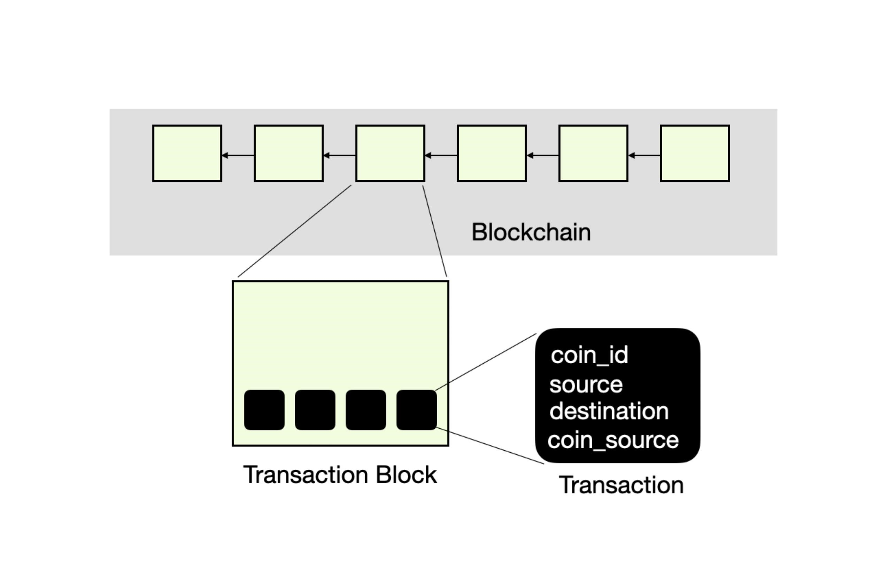
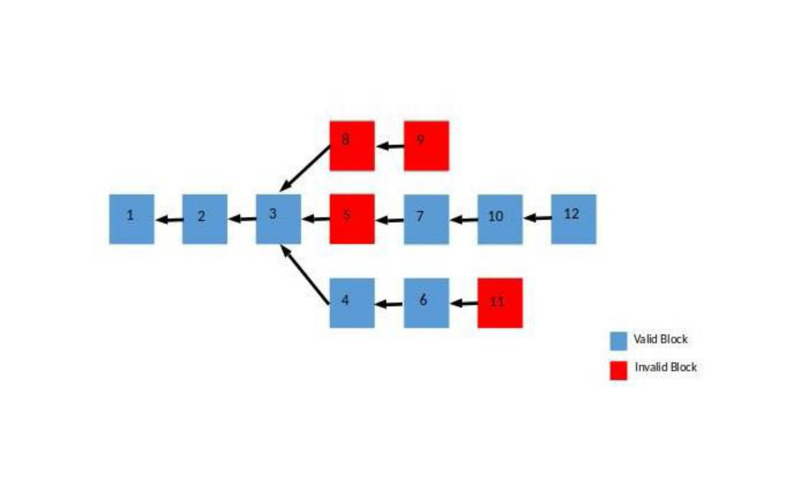

# DS_Coin106
This is an independent cyptocurrency made using the cryptographic concepts like hash functions,digital signatures with underlying data structures like linked list, queues, trees, etc.
## Introduction
This is a course project of the course COL106(Data Structures and Algorithms) taken by our course instructors [Prof. Amitabha Bagchi](https://www.cse.iitd.ac.in/~bagchi/) and [Prof. Venkata Koppula](https://iitd.irins.org/profile/214118). It involves processes very similar to actual cryptocurrencies which are mentioned further.\
Some basic conventions/technologies used in the project: 
* Every coin is a six digit unique number.
* Every transaction has the following information:
  * the coin being transferred
  * the source (that is, the person spending this coin)
  * the destination (that is, the person receiving this coin)
  * some information to indicate when the source received this coin from someone (this will be described in more detail later).\
  <a/>
   For simplicity, we assume every transaction consists of exactly one coin.
* A ***transaction-block*** consists of a set of transactions. Let ***tr-count*** denote the number of transactions per block. The transaction-block will also have additional     attributes, which will be discussed below.
* A ***blockchain*** is an authenticated linked list of transaction-blocks.
* ***Pending transactions*** and ***transaction-queue***: All the transactions in the transaction-block are processed transactions. Additionally, we have a transaction-queue       which contains ***pending transactions***. Every new transaction is first added to the transaction-queue, and later moved to a transaction-block (and thus added to the           blockchain).\

The blockchain is an authenticated list of transaction blocks. Each transaction block consists of transactions (together with additional attributes). Each transaction contains the coin-id, the source of the transaction (that is, the buyer), the destination (the seller) and coin-source (that is, the previous transaction block where the source received this coin)

## DS_Coin:The Cryptocurrency
In our cryptocurrency, any participant can either be a:
* ***buyer*** - someone who wishes to buy an item, and therefore send a coin
* ***seller*** - someone who wishes to sell an item, and therefore wishes to receive a coin from the buyer
* ***miner*** - someone who verifies and approves the transactions 

There are two components of this cryptocurrency the one where ***miners*** behave honestly ***(DSCoin_Honest)*** and other where malicious miners are present ***(DSCoin_Malicious)***

### DSCoin_Honest: A Cryptocoin for Honest Users
Initially, all participants receive a certain number of coins from the moderator. All these are added in transaction-blocks to the blockchain and there are no ***pending transactions.*** \
After this initial setup, suppose person A wishes to buy an item from person B, and therefore wishes to send one coin to person B (we will refer to person A as the buyer and person B as the seller ). The buyer adds a transaction to the transaction-queue; this transaction must contain the coin-id he/she wishes to spend, the buyer's identification, and the seller's identification. \
Additionally, the transaction also points to a transaction-block in the blockchain where person A received this coin; we will call this the ***coinsrc block*** of this coin. Therefore, any transaction is a 4-tuple : ***(coin-id, buyer-id, seller-id, coinsrc block)***. This 4-tuple is added to the queue of pending transactions. Once there sufficiently many transactions in the transaction-queue, a miner removes them from this queue, and mines a transaction-block. \
After creating the transaction-block, the miner adds this block to the blockchain. At this point, the buyer (person A) can check that his/her transaction is included in the latest transaction block. If so, the buyer sends a proof of payment to the seller, and the seller can check this proof. \
To summarize, here are the steps involved in a transaction from a buyer to a seller:
1. Buyer adds transaction to the transaction-queue.
2. Miner collects many such transactions, mines a transaction-block and adds the block to the blockchain.
3. Once the block is added to the blockchain, the buyer checks that his/her transaction is present in the last block. If so, the buyer computes a ***"proof of membership"*** of this transaction in one of the transaction block, and sends it to the seller.
4. Finally, the seller verifies this "proof of membership". 

Each step is explained below:

1. #### Initializing a Coin-Send
   Suppose buyer wants to send a coin to a seller. Every buyer/seller has a ***UID***. The buyer creates a new transaction t, where the ***coinID, Source, Destination*** and        ***coinsrc block*** are set appropriately. After this, the buyer adds this transaction to the transaction queue. Additionally, the buyer also maintains his/her own queue of      pending transactions (called in ***process trans***), and the buyer adds the transaction to this queue.
2. #### Mining a Transaction Block: Honest setting
   First, we discuss the structure of a transaction block, and then discuss how it is mined. A transaction-block consists of the following attributes:
   * ***tr-count:*** the number of transactions in the block. We will assume this is a power of 2.
   * ***trarray:*** an array of transactions.
   * ***trsummary:*** a 64-character summary of the entire transaction-array. This is computed using a Merkle tree on the trarray.
   * ***Tree:*** the Merkle tree on trarray.
   * ***nonce:*** a 10-digit string that is used to compute the dgst.
   * ***dgst:*** a 64-character string, obtained by computing the CRF on previous digest, transaction-summary and a 10-digit string called nonce, separated by #. The nonce must      be such that the first four characters of dgst are all zeroes.
   
   The job of the miner is to create a transaction-block consisting of tr-count valid transactions (that is, none of the transaction should be a double spending). More formally,    we say that a transaction t is invalid if any of the following holds true:
   * the coinsrc block of t does not contain any transaction t0 such that t0.coinID = t.coinID and t.Source = t0.Destination.
   * above check passes, but this coin has been spent in one of the future transaction-blocks, or is present multiple times in the transaction queue.
   
   The miner collects tr-count - 1 number of valid transactions from the TransactionQueue. The miner also gets a reward for mining this block. This reward, in this                  cryptocurrency, is one coin. The coinID of this coin will be the smallest six-digit coin-id (>= 100000) that is available. The miner creates a transaction with this coinID,      sets the Source to be null, Destination is the miner, and coinsrc block is set to null. This new coin belongs to the miner, and can be spent by the miner for future              transactions.
   
   Therefore, the  miner has tr-count number of transactions, which are included in the transaction block as follows:
   1. adds the transactions to the transaction array trarray.
   2. computes Merkle tree on the transaction array. Every node in the Merkle tree has a string attribute called val. For a leaf node corresponding to transaction, the val is         simply CRF applied on a concatenation of the coin-id, source id, destination id and dgst of the coinsrc block corresponding to this transaction (separated by #). For any         intermediate node, it is computed by applying the CRF on the concatenation of left child's val and right child's val (separated by #).
   3.  finds a 10-digit string nonce such that CRF applied on the previous block's digest, the Merkle tree's root's val (i.e., also the current block's trsummary) and nonce            (separated by #) outputs a string with first four characters being 0. This output is the new block's digest. Such a nonce can be found by sequentially searching over the        space of all 10-digit strings.
  
   At this point, the miner has computed all the attributes for the new transaction block. The miner simply adds this transaction block to the blockchain.
3. #### Finalizing a Coin-Send
   Once a transaction t is added to a transaction block in the blockchain, the buyer can convince a seller that he/she has sent a coin to the seller. Suppose the transaction is    included in a block b0, and there are r blocks b1; b2; : : : ; br in the chain after b0 (that is, br is the last block in the blockchain, br􀀀1 the previous block, and so on).    The buyer first computes a sibling-coupled path to the root of b0's Merkle tree. The buyer sends the following information to the seller:
   * the sibling-coupled-path-to-root corresponding to transaction t
   * the dgst of b0:previous.
   * the dgst, nonce and trsummary for each b0, b1; : : : ; bk.
   
   We will refer to this entire tuple as the proof of transaction. The buyer also removes this transaction from his/her own in process trans queue.
4. #### Verification of Transaction by the Seller  
   Suppose a seller is the destination for a transaction t in block b0, and suppose there are k blocks b1; : : : ; bk in the blockchain after b0. The seller receives a sibling-    coupled-path-to-root, the dgst of b0:previous, the (dgsti; noncei; trsummaryi) pairs for each of the blocks bi, i 2 [0; k]. The seller checks the following:
   * first checks that he/she is indeed the destination for the transaction t.
   * next checks the sibling-coupled-path-to-root, and checks that the final value in the sibling-coupled-path-to-root is equal to trsummary0.
   * checks that each of the dgsti strings are valid (for i 2 [0; k]) { the seller checks that the first four characters of dgsti are 0, and that dgsti is correctly computed          using dgsti􀀀1, noncei and trsummaryi.
   * finally checks that dgstk matches the dgst of the last block in the blockchain.
   
### DSCoin Malicious: Handling Malicious Miners
The solution described in the previous section works in the setting where all miners are honest. However, one of the prime advantages of a cryptocurrency is the decentralized aspect, and in this setting, we cannot assume that the miners are honest. Indeed, it is possible that a buyer (source) adds an invalid transaction to the pendingTransactions queue, and then the same buyer mines a block that includes the invalid transaction. Or maybe the malicious buyer has a miner friend who includes the invalid transaction in the
transaction block.

Interestingly, malicious miners are handled using a clever mix of incentive-engineering and data structures (and no additional cryptography involved here). First, the blockchain is generalized { instead of having a linked list, we have a tree-like structure, where we store all leaf blocks of the tree, and for each block, we have a pointer to the previous block as before. For instance, in Figure, we have three leaf blocks { blocks numbered 9, 11, 12. Note that anyone can identify these maliciously mined blocks { one only needs to check the validity of each transaction in the block, check if the Merkle tree is computed correctly and finally check that the digest is computed correctly. We define a transaction block to be valid if the dgst is correct, all transactions in the block are valid and the Merkle tree is computed properly. You can assume that the first
few blocks (created by the moderator) are valid blocks. The longest valid chain is defined to be the longest sequence of blocks, starting with the first block, consisting of only valid blocks. If a honest miner is mining a new block, then the miner finds the longest valid chain, and attaches the new transaction to this valid chain. For instance, in Figure 2, the longest valid chain is the sequence (1; 2; 3; 4; 6), and therefore, the new block should have 6 as its previous block. If 6 was also an invalid block, then the longest valid chain terminates at 4. Finally, if 5 was a valid block, then the longest valid chain would be terminating at 12.

The malicious blockchain has a tree-like structure. Each block has a pointer to the previous block, and we store all leaf-blocks. In this figure, there are three leaf blocks, and four invalid blocks (shown in red).

#### How Does the Above Deter Malicious Mining
If the majority of miners are honest, then eventually, the longest chain in the blockchain will consist of only valid transactions, and malicious blocks are thus discarded. You can assume that the cryptocurrency software automatically checks that the digest is correctly computed, and has an appropriate number of zeroes. But the other validity check - ensuring that there is no double spending - is done by the fellow miners.

The role of the nonce, and how it ensures that there are no invalid transactions in the blockchain: In this assignment, we want the first four characters of the dgst to be zeroes, but in real-world cryptocurrencies, many more initial characters need to be zeroes. Therefore, computing the nonce is the most expensive operation in the computation of a new block, and requires a lot of computational resources. The reward coin given to the miner is the incentive for the miner to behave honestly. If a miner has invested
so much computational resources in computing the correct nonce and dgst, then any reasonable miner will also ensure that the transactions in the transaction block are valid (otherwise, if the miner's block is invalid, then all the computing effort goes waste).

### Conclusion
The cryptocurrency described above is close to real-world cryptocurrencies (such as Bitcoin). Here are some
differences:
* Here, we assumed every person has a UID. In Bitcoin, every person chooses a signing/verification key, and the verification key is the person's UID. Whenever someone mines a  b   block, he/she also computes a signature on the block.
* Here, we assumed that every transaction consists of exactly one coin spending, and every miner receives one coin as reward. In real life, a transaction allows person A to send   any number of coins to person. Moreover, person A can also include a "reward" for the miner. This incentivises the miner to include person A's transaction in the transaction     block.
* Bitcoin uses a cool stack-based scripting language. Every transaction includes a small program in this programming language.

